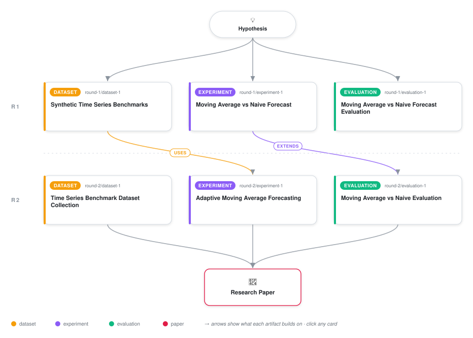

# Robust Temporal Smoothing: Evaluating Moving Average Baselines and Adaptive Window Sizing for Time Series Forecasting

<div align="center">

<a href="https://cdn.jsdelivr.net/gh/AMGrobelnik/ai-invention-230d6e-robust-temporal-smoothing-evaluating-mov@main/workflow.svg">
<picture>
  <source media="(prefers-color-scheme: dark)" srcset="workflow-dark.svg">
  
</picture>
</a>

<sub>🖱️ <b><a href="https://cdn.jsdelivr.net/gh/AMGrobelnik/ai-invention-230d6e-robust-temporal-smoothing-evaluating-mov@main/workflow.svg">Open the interactive diagram</a></b> — every card links to its artifact folder.</sub>

</div>

> **TL;DR** — Comprehensive research paper evaluating 3-point moving average against naive persistence across 4,700 time series samples.

<details>
<summary>Full hypothesis</summary>

An adaptive moving average with dynamic window sizing tuned via rolling volatility outperforms both fixed moving averages and naive persistence across diverse time series regimes by balancing noise suppression against temporal lag during trend transitions.

</details>

[](https://cdn.jsdelivr.net/gh/AMGrobelnik/ai-invention-230d6e-robust-temporal-smoothing-evaluating-mov@main/paper.pdf) [](https://github.com/AMGrobelnik/ai-invention-230d6e-robust-temporal-smoothing-evaluating-mov/tree/main/paper_latex)

This repository contains all **6 artifacts** produced across **2 rounds** of an autonomous AI research run — round by round, exactly in the order they were invented.

## Round 1

| Artifact | Type | Demo | Source | Builds on |
|----------|------|------|--------|-----------|
| **[Synthetic Time Series Benchmarks](https://github.com/AMGrobelnik/ai-invention-230d6e-robust-temporal-smoothing-evaluating-mov/tree/main/round-1/dataset-1)** | [](https://github.com/AMGrobelnik/ai-invention-230d6e-robust-temporal-smoothing-evaluating-mov/tree/main/round-1/dataset-1) | [](https://colab.research.google.com/github/AMGrobelnik/ai-invention-230d6e-robust-temporal-smoothing-evaluating-mov/blob/main/round-1/dataset-1/demo/data_code_demo.ipynb) | [](https://github.com/AMGrobelnik/ai-invention-230d6e-robust-temporal-smoothing-evaluating-mov/tree/main/round-1/dataset-1/src) | — |
| **[Moving Average vs Naive Forecast](https://github.com/AMGrobelnik/ai-invention-230d6e-robust-temporal-smoothing-evaluating-mov/tree/main/round-1/experiment-1)** | [](https://github.com/AMGrobelnik/ai-invention-230d6e-robust-temporal-smoothing-evaluating-mov/tree/main/round-1/experiment-1) | [](https://colab.research.google.com/github/AMGrobelnik/ai-invention-230d6e-robust-temporal-smoothing-evaluating-mov/blob/main/round-1/experiment-1/demo/method_code_demo.ipynb) | [](https://github.com/AMGrobelnik/ai-invention-230d6e-robust-temporal-smoothing-evaluating-mov/tree/main/round-1/experiment-1/src) | — |
| **[Moving Average vs Naive Forecast Evaluation](https://github.com/AMGrobelnik/ai-invention-230d6e-robust-temporal-smoothing-evaluating-mov/tree/main/round-1/evaluation-1)** | [](https://github.com/AMGrobelnik/ai-invention-230d6e-robust-temporal-smoothing-evaluating-mov/tree/main/round-1/evaluation-1) | [](https://colab.research.google.com/github/AMGrobelnik/ai-invention-230d6e-robust-temporal-smoothing-evaluating-mov/blob/main/round-1/evaluation-1/demo/eval_code_demo.ipynb) | [](https://github.com/AMGrobelnik/ai-invention-230d6e-robust-temporal-smoothing-evaluating-mov/tree/main/round-1/evaluation-1/src) | — |

## Round 2

| Artifact | Type | Demo | Source | Builds on |
|----------|------|------|--------|-----------|
| **[Time Series Benchmark Dataset Collection](https://github.com/AMGrobelnik/ai-invention-230d6e-robust-temporal-smoothing-evaluating-mov/tree/main/round-2/dataset-1)** | [](https://github.com/AMGrobelnik/ai-invention-230d6e-robust-temporal-smoothing-evaluating-mov/tree/main/round-2/dataset-1) | [](https://colab.research.google.com/github/AMGrobelnik/ai-invention-230d6e-robust-temporal-smoothing-evaluating-mov/blob/main/round-2/dataset-1/demo/data_code_demo.ipynb) | [](https://github.com/AMGrobelnik/ai-invention-230d6e-robust-temporal-smoothing-evaluating-mov/tree/main/round-2/dataset-1/src) | — |
| **[Adaptive Moving Average Forecasting](https://github.com/AMGrobelnik/ai-invention-230d6e-robust-temporal-smoothing-evaluating-mov/tree/main/round-2/experiment-1)** | [](https://github.com/AMGrobelnik/ai-invention-230d6e-robust-temporal-smoothing-evaluating-mov/tree/main/round-2/experiment-1) | [](https://colab.research.google.com/github/AMGrobelnik/ai-invention-230d6e-robust-temporal-smoothing-evaluating-mov/blob/main/round-2/experiment-1/demo/method_code_demo.ipynb) | [](https://github.com/AMGrobelnik/ai-invention-230d6e-robust-temporal-smoothing-evaluating-mov/tree/main/round-2/experiment-1/src) | <sub><i>uses:</i><br/>[dataset‑1&nbsp;(R1)](https://github.com/AMGrobelnik/ai-invention-230d6e-robust-temporal-smoothing-evaluating-mov/tree/main/round-1/dataset-1)</sub> |
| **[Moving Average vs Naive Evaluation](https://github.com/AMGrobelnik/ai-invention-230d6e-robust-temporal-smoothing-evaluating-mov/tree/main/round-2/evaluation-1)** | [](https://github.com/AMGrobelnik/ai-invention-230d6e-robust-temporal-smoothing-evaluating-mov/tree/main/round-2/evaluation-1) | [](https://colab.research.google.com/github/AMGrobelnik/ai-invention-230d6e-robust-temporal-smoothing-evaluating-mov/blob/main/round-2/evaluation-1/demo/eval_code_demo.ipynb) | [](https://github.com/AMGrobelnik/ai-invention-230d6e-robust-temporal-smoothing-evaluating-mov/tree/main/round-2/evaluation-1/src) | <sub><i>extends:</i><br/>[experiment‑1&nbsp;(R1)](https://github.com/AMGrobelnik/ai-invention-230d6e-robust-temporal-smoothing-evaluating-mov/tree/main/round-1/experiment-1)</sub> |

## Repository Structure

Artifacts are grouped by the round of invention that produced them. Each
artifact has its own folder with source code and a self-contained demo:

```
.
├── round-1/                         # One folder per round of invention
│   ├── experiment-1/
│   │   ├── README.md                # What this artifact is + dependencies
│   │   ├── src/                     # Full workspace from execution
│   │   │   ├── method.py            # Main implementation
│   │   │   ├── method_out.json      # Full output data
│   │   │   └── ...                  # All execution artifacts
│   │   └── demo/                    # Self-contained demo
│   │       └── method_code_demo.ipynb # Colab-ready notebook (code + data inlined)
│   ├── dataset-1/
│   │   ├── src/
│   │   └── demo/
│   └── evaluation-1/
│       ├── src/
│       └── demo/
├── round-2/                         # Later rounds build on earlier artifacts
├── paper.pdf                        # Research paper
├── paper_latex/                     # LaTeX source files
├── workflow.svg                     # Artifact dependency diagram (this page's header)
└── README.md
```

## Running Notebooks

### Option 1: Google Colab (Recommended)

Click the "Open in Colab" badges above to run notebooks directly in your browser.
No installation required!

### Option 2: Local Jupyter

```bash
# Clone the repo
git clone https://github.com/AMGrobelnik/ai-invention-230d6e-robust-temporal-smoothing-evaluating-mov
cd ai-invention-230d6e-robust-temporal-smoothing-evaluating-mov

# Install dependencies
pip install jupyter

# Run any artifact's demo notebook
jupyter notebook <artifact_folder>/demo/
```

## Source Code

The original source files are in each artifact's `src/` folder.
These files may have external dependencies - use the demo notebooks for a self-contained experience.

---
*Generated by AI Inventor Pipeline - Automated Research Generation*
